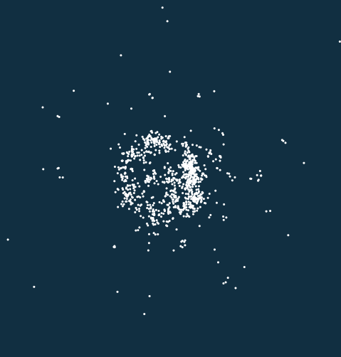
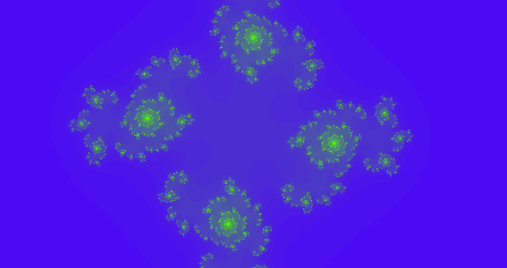

# Taichi 图形课 S1

## Lecture01

### N body problem

- Change symplectic euler to midpoint method
- Add a mouse event (click to mimic a black hole)

### Julia set

- Change the recurrence relation to $z = z^4 + c$ (shape)
- Change the color of this animation to RGB, using a simple linear blended colormap

## Lecture02

### Galaxy

- Change the mass of the stars on the fly (Controlled by GUI widgets -- a scrollbar)
- Add another class of SuperStars with:
    - different visualization (OrangeRed)
    - different initialization (distributed on the diagonal)
    - orders of magnitudes heavier

